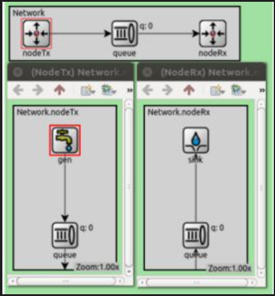
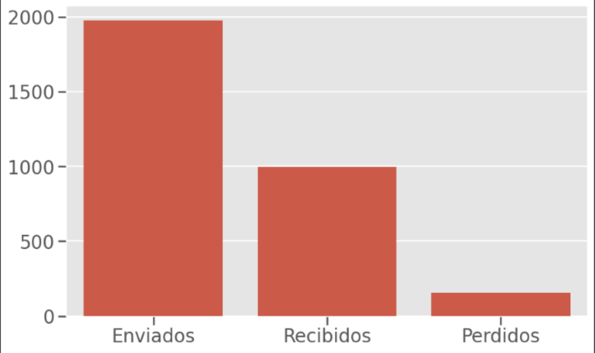
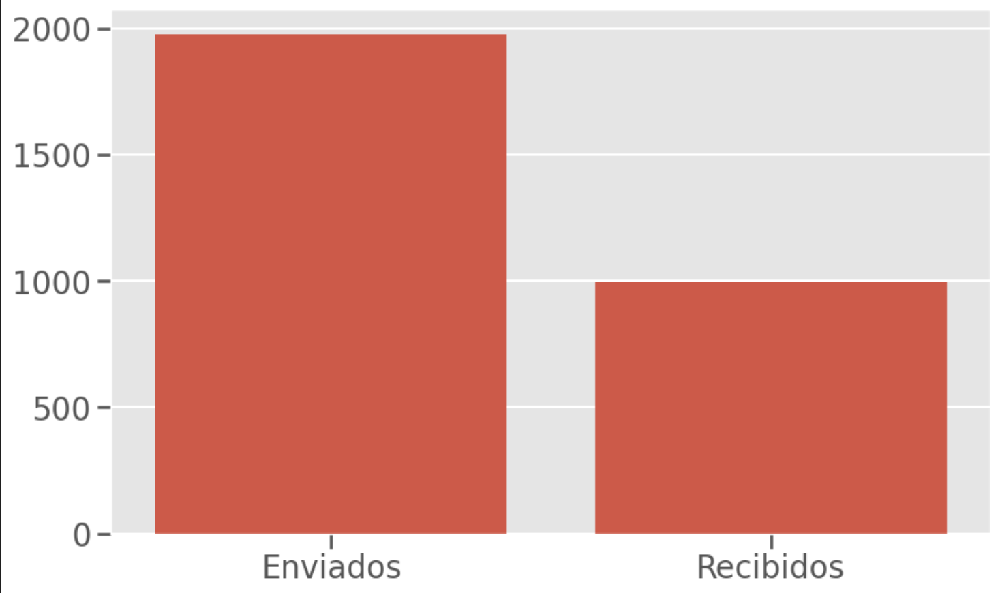
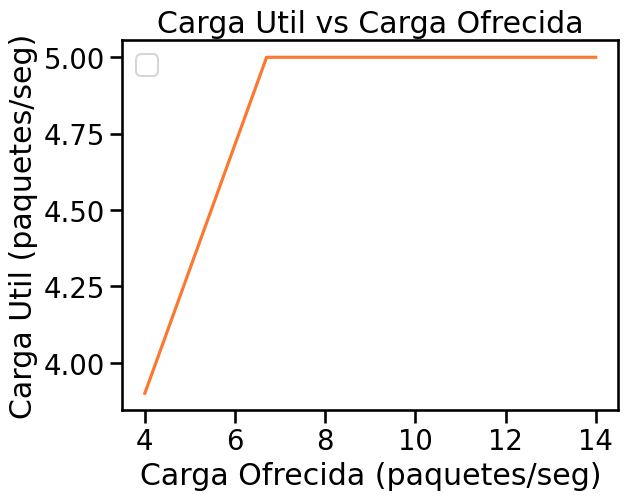
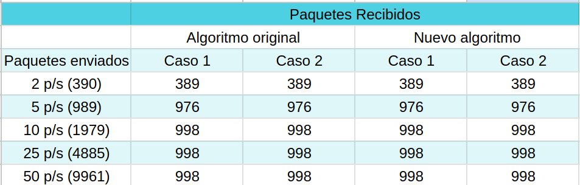

# Análisis de flujo y congestión de redes utilizando simulación discreta

Vamos a diseñar y proponer soluciones de control de congestión y flujo, implementando un algoritmo y analizando tráfico de red bajo tasas de datos acotadas y tamaño de buffers limitados, mediante una politica en donde se retroalimenta en base a un feedback del cual se toma la decision de enviar o no el paquete.

## Que es flujo?
Flujo es el concepto del transporte de recursos a través de conecciones de datos. Cuando se habla de control de flujo, se intenta evitar que el emisor sobrecargue al receptor enviando datos más rápido de lo que este puede procesar.
## Que es congestion?
Es un fenomeno que ocurre durante el flujo de informacion, la demanda de trafijo supera la capcidad disponible, esto provoca retrasos, fallos, perdidas de eficiencia, etc. Cuando se habla de control de congestión, se intenta evitar la sobrecarga de la red (por ejemplo, enrutadores llenos o enlaces saturados) que puede causar pérdida de paquetes o alta latencia.
## Metodologia de trabajo:
La metodología de análisis de datos en simulaciones discretas es un enfoque sistemático que permite estudiar el comportamiento de sistemas complejos mediante la recolección, procesamiento y evaluación estadística de los datos generados por modelos de simulación de eventos discretos. Una de las ventajas de utilizar este enfoque, es que permite analizar los sistemas sin necesidad de implementarlos fisicamente, otorgando una gran flexibilidad a la hora de modificar los distintos parámetros del sistema. Por otro lado, la validez de los resultados depende fuertemente de la calidad del modelo, por lo que una mala representación del sistema real puede llevar a conclusiones incorrectas.

---

# Analisis

## Nuestra representacion del sistema

## Casos de estudio - Analisis:

### Caso de estudio 1:

    **"NodeTx.Queue"  a  "Queue"** : datarate = 1 Mbps y delay = 100 us

    **"Queue"  a  "NodeRx.Queue"** : datarate = 1 Mbps y delay = 100 us

    **"NodeRx.Queue"  a  "Sink"** : datarate = 0.5 Mbps

    <h2>Buffer</h2>

![analisisCaso1BuffersGi[0.1]](./images/analisisCaso1BuffersGi[0.1].jpeg)

    <h2>Paquetes enviados y recibidos</h2>

![analisisCaso1EnvRecPerGi[0.1]](./images/analisisCaso1EnvRecPerGi[0.1].jpeg)

### Caso de estudio 2:

    **"NodeTx.Queue" a "Queue"** : datarate = 1 Mbps y delay = 100 us

    **"Queue"  a  "NodeRx.Queue"** : datarate = 0.5 Mbps y delay = 100 us

    **"NodeRx.Queue"  a  "Sink"** : datarate = 1 Mbps

    <h2>Buffer</h2>

![analisisCaso2BuffersGi[0.1]](./images/analisisCaso2BuffersGi[0.1].jpeg)

    <h2>Paquetes enviados y recibidos</h2>

![analisisCaso2EnvRecPerGi[0.1]](./images/analisisCaso2EnvRecPerGi[0.1].jpeg)

## Analisis del Generation Interval:
- El Generation Interval es una constante que va a definir la velocidad de generacion de paquetes en nuestra red de forma tal que el tiempo entre la generacion de un paquete y otro sera proporcional a GI. Es importante pensar que constante es conveniente utilizar. Un GI muy alto no nos va a dar informacion interesante pues es un caso de muy poca exigencia para la red, el flujo es muy lento por lo que no genera problemas de congestion ni flujo. En cambio, un GI bajo es probable que genere problemas de congestion pues se puede llegar al caso de que se generen paquetes mas rapido que la velocidad de transporte/procesamiento en la red, provocando demora en los paquetes y hasta perdida de ellos.
- En base a experimentos pudimos denotar que para valores de GI mayores a 0.2 no tenemos problema alguno. Los buffers no se llenan demasiado, el delay es razonable y no hay perdida de paquetes. Podemos concluir que no es un buen valor pues nuestro diseño incial de red puede soportar esta tasa de generacion de paquetes sin ningun problema, por lo que no obtendremos informacion importante a la hora de comparar resultados con el algoritmo que propondremos luego.
### Generation Interval 0.3
#### Buffers Caso 1 
![analisisCaso1BuffersGi[0.3]](./images/analisisCaso1BuffersGi[0.3].jpeg)
#### Buffers Caso 2
![analisisCaso2BuffersGi[0.3]](./images/analisisCaso2BuffersGi[0.3].jpeg)
#### Delay Caso 1
![analisisCaso1DelayGi[0.3]](./images/analisisCaso1DelayGi[0.3].jpeg)
#### Delay Caso 2
![analisisCaso2DelayGi[0.3]](./images/analisisCaso2DelayGi[0.3].jpeg)
#### Enviados vs Recibidos vs Perdidos Caso 1
![analisisCaso1EnvRecPerGi[0.3]](./images/analisisCaso1EnvRecPerGi[0.3].jpeg)
#### Enviados vs Recibidos vs Perdidos Caso 2
![analisisCaso2EnvRecPerGi[0.3]](./images/analisisCaso2EnvRecPerGi[0.3].jpeg)
### Generation Interval 0.2
#### Buffers Caso 1 
![analisisCaso1BuffersGi[0.2]](./images/analisisCaso1BuffersGi[0.2].jpeg)
#### Buffers Caso 2
![analisisCaso2BuffersGi[0.2]](./images/analisisCaso2BuffersGi[0.2].jpeg)
#### Delay Caso 1
![analisisCaso1DelayGi[0.2]](./images/analisisCaso1DelayGi[0.2].jpeg)
#### Delay Caso 2
![analisisCaso2DelayGi[0.2]](./images/analisisCaso2DelayGi[0.2].jpeg)
#### Enviados vs Recibidos vs Perdidos Caso 1
![analisisCaso1EnvRecPerGi[0.2]](./images/analisisCaso1EnvRecPerGi[0.2].jpeg)
#### Enviados vs Recibidos vs Perdidos Caso 2
![analisisCaso2EnvRecPerGi[0.2]](./images/analisisCaso2EnvRecPerGi[0.2].jpeg)
  
- Para valores de GI menores a 0.1 es otro el caso. Podemos denotar que ciertos buffers se llenan hasta su limite provocando perdida de paquetes y un gran aumento en el delay. Hemos hallado un caso interesante de estudio, un GI de 0.1 genera grandes problemas en nuestra red y esto es un desafio a resolver por el diseño que propondremos.

### Generation Interval 0.1
#### Buffers Caso 1 
![analisisCaso1BuffersGi[0.1]](./images/analisisCaso1BuffersGi[0.1].jpeg)
#### Buffers Caso 2
![analisisCaso2BuffersGi[0.1]](./images/analisisCaso2BuffersGi[0.1].jpeg)
#### Delay Caso 1
![analisisCaso1DelayGi[0.1]](./images/analisisCaso1DelayGi[0.1].jpeg)
#### Delay Caso 2
![analisisCaso2DelayGi[0.1]](./images/analisisCaso2DelayGi[0.1].jpeg)
#### Enviados vs Recibidos vs Perdidos Caso 1
![analisisCaso1EnvRecPerGi[0.1]](./images/analisisCaso1EnvRecPerGi[0.1].jpeg)
#### Enviados vs Recibidos vs Perdidos Caso 2
![analisisCaso2EnvRecPerGi[0.1]](./images/analisisCaso2EnvRecPerGi[0.1].jpeg)
    
## Observaciones

A partir de las graficas podemos observar que:

- En el Caso 1, el buffer correspondiente a la Queue del Node Rx se llena y muy rapido. El resto de buffers no tienen alteraciones significativas. 
- En el Caso 2, el buffer correspondiente a la Queue se llena y muy rapido. El resto de buffers no tienen alteraciones significativas.

Este comportamiento tiene mucho sentido, en ambos casos estamos teniendo un efecto de "cuello de botella" que provoca que un buffer se congestione y llene muy rapido, pues tiene un flujo de entrada mucho mas rapido que su flujo de salida. 

En el Caso 1 esto sucede en el buffer de la Queue del Node Rx pues tenemos un datarate de entrada desde la Queue de 1Mbps y un datarate de salida hacia el Sink de 0.5Mbps. Este buffer tiene un tamaño limitado de 200 paquetes lo que provoca que al llenar su capacidad y seguir recibiendo paquetes tengamos un problema, se pierden paquetes.

Analogamente en el Caso 2, el conflicto se da en el buffer de la Queue pues tenemos un datarate de entrada desde Node Tx de 1Mbps y un datarate de salida hacia Node Rx de 0.5Mbps.

En ambos casos tenemos la misma proporcion entre paquetes enviados, recibidos y perdidos. Esto es normal pues la proporcion entre paquetes enviados y recibidos es practicamente la mitad, esto condice con la tasa de transferencia de entrada y la de salida donde tambien se da esta proporcion. Esta proporcion no es exacta pues nuestra simulacion se detiene por tiempo provocando que haya paquetes que fueron generados y no llegaron a ser recibidos ni fueron perdidos, estos paquetes quedan en buffers de transito.

Nuestro trabajo sera diseñar e implementar un algoritmo que pueda lidiar con este problema de congestion tratando de evitar la perdida de paquetes.

---
---

# Diseño
## Implementacion de algortimo
 Dadas estas observaciones, ahora buscamos implementar un algoritmo de control de flujo y congestión de manera que se evite la perdida de paquetes por saturación en los buffers. Vamos a considerar que el generador (la fuente) es incontrolable, ya que éste es el caso en muchos sistemas y no podemos asumir lo contrario, queremos que el modelo sea lo más general posible. Por lo tanto, el control de flujo y congestión va a aplicarse desde el nodo transmisor hacia adelante, no sobre el origen del tráfico. Es importante notar que, con esta restricción, es imposible garantizar que no haya pérdida de paquetes. El sistema lidiará con el exceso de datos en los buffers vía feedback entre los módulos. Funciona de esta manera: 

 - Paso 1: el transmisor envía un paquete de tipo feedback al receptor avisando que enviará un paquete.
 - Paso 2: el receptor (dado que el tamaño de paquete es fijo) conoce el tamaño del paquete y envía un paquete de tipo feedback al transmisor indicando si tiene o no tiene espacio en su buffer.
 - Paso 3: si la respuesta es afirmativa, el transmisor envía el paquete hacia la queue, de lo contrario, el transmisor no envía el paquete y se vuelve al Paso 1.
 - Paso 4: la queue envía hacia el nodo receptor el paquete más antiguo recibido desde el nodo transmisor apenas pueda
 - Paso 5: el nodo receptor envía el paquete mas antiguo recibido desde la queue al sink apenas pueda
 
En caso de que el generador envíe paquetes a una velocidad demasiado alta, el buffer del transmisor se llenará y comenzará a descartar paquetes.

Notar que, el tamaño del buffer de la queue intermedia entre el emisor y el receptor es notoriamente mayor a los buffers del nodo Tx y Rx, por lo que, si los paquetes se quedan atascados en queue, es mejor para nosotros ya que el descarte de paquetes comenzará mucho despues que si se hubieran atascado en el buffer de otro nodo. Sin embargo, en ese caso la latencia de la red aumentará mucho.

## Nuestra representacion del sistema

    

## Casos de estudio - Diseño:

### Caso de estudio 1:

    **NodeTx a Queue** : datarate = 1 Mbps y delay = 100 us

    **Queue a NodeRx** : datarate = 1 Mbps y delay = 100 us

    **Queue a Sink** : datarate = 0.5 Mbps

    <h2>Buffer</h2>

    <h2>Paquetes enviados y recibidos</h2>

### Caso de estudio 2:

    **NodeTx a Queue** : datarate = 1 Mbps y delay = 100 us

    **Queue a NodeRx** : datarate = 0.5 Mbps y delay = 100 us

    **Queue a Sink** : datarate = 1 Mbps

    <h2>Buffer</h2>

    <h2>Paquetes enviados y recibidos</h2>

## Conclusiones sobre las observaciones
- En el caso 1, debido a que la tasa de transferencia del nodoRx al sink es el cuello de botella, su buffer se llena ráidamente. Antes de que se llene el buffer del nodoRx, el buffer del nodoTx está casi vacío, porque recibe feedback positivo del nodoRx y puede enviar todos los paquetes que le llegan. Tan pronto como el buffer del nodoRx se llena, el buffer del nodoTx comienza a encolar paquetes, pues no puede enviarlos, evitando así que el nodoRx descarte una gran cantidad de paquetes.
- En el caso 2, debido a que la tasa de transferencia de la queue hacia el nodoRx es el cuello de botella, el nodoRx se deshace rápido de los paquetes que entran a su buffer, pues los envía en la mitad de tiempo de la que tardan en llegarle, por esto es que los paquetes se van "atascando" en queue. Convenientemente, el tamaño del buffer de queue es mucho mayor al tamaño del buffer del nodoRx, por lo que no se produce pérdida de paquetes (ocurriría si el tiempo de simulación fuese mayor).

#### Carga ofrecida vs Carga útil

- CO vs CU algoritmo original caso 1

- CO vs CU algoritmo original caso 2

- CO vs CU nuevo algoritmo caso 1

- CO vs CU nuevo algoritmo caso 2

- Resumen

Como vemos, todos los valores dan iguales entre casos y convergen a 998 (5 p/s) recibidos a medida que incrementamos la cantidad de paquetes generados por segundo. La convergencia se debe a que llegamos al límite de paquetes que el nodo receptor alcanza a mandar al sink en el tiempo de simulación, por lo que aumentar más los paquetes generados no va a hacer que se reciban más. Vemos además que nuestro algoritmo no disminuye la carga útil, se recibe la misma cantidad de paquetes y se pierden menos. 

- Podemos concluir que el nuevo algoritmo mejoró la pérdida de paquetes con respecto a la implementación anterior, sin embargo en las gráficas de paquetes enviados y paquetes recibidos, no hubo cambios. Esto se debe a que la simulación tiene un límite de tiempo, y termina al alcanzarlo, incluso cuando hay paquetes "en camino" en los buffers de nodeTx y QueueTx. Por lo que esta diferencia entre paquetes enviados y recibidos no se debe a una pérdida de paquetes. Por otro lado, el algoritmo no resuelve los problemas de congestión de la red. Esto lo deducimos de la gráfica de los buffers del caso 2. Los paquetes se atascan en el buffer de la queue, debido a que hay un cuello de botella entre el nodo queue y el nodo receptor. Esto retrasa considerablemente la pérdida de paquetes, pero no garantiza que no ocurran. Más aún, este atascamiento en el buffer de queue incrementa considerablemente la latencia de la red. Sin embargo, esto era de esperarse ya que no podemos desde la capa de transporte alterar la frecuencia con la que los paquetes nos llegan, así que este algoritmo solo intenta manejarlos de forma en la que se pierda la menor cantidad de paquetes posibles.

---
---

# Discusion
### Limitaciones
- Tuvimos que aprender el uso de omnett desde 0, por lo que no pudimos sacarle potencial a sus aplicaciones
- Problemas de compatibilidad entre archivos(ej: poder extraer records en una VM pero no en una comun)
### Logros
- Una mejor vision del comportamiento de un algoritmo de control de flujo y congestion

# Referencias
- [Manual de omnnet v6.1](https://doc.omnetpp.org/omnetpp/manual/) provisto por la catedra

# Anexo
### Durante el desarrollo del trabajo, se utilizaron herramientas de inteligencia artificial con fines de apoyo conceptual y técnico. A continuación se detalla el uso específico:
- ChatGPT
- DeepSeek

### Propósito del uso
- Ayuda con sintaxis del lenguaje y errores de Omnet
- Analisis de logs de Omnet para verificar correcto funcionamiento del modelo
- Identificación de errores en la lógica del código

### Forma de interacción
- En el caso de las ayudas con C++ y omnet, se preguntó con lenguaje natural sin dar demasiado contexto más que un par de lineas de código o el mensaje de error de omnet
- En el caso de los logs, se le explicó el correcto funcionamiento del modelo en lenguaje
natural y qué debía verificar que efectivamente estuviese ocurriendo y luego se le mandó
los logs de la simulación
- En el caso de los errores del código, se enviaron los archivos pertinentes acompañados
de explicaciones en lenguaje natural sobre el comportamiento esperado y los errores
observados, dando así el contexto suficiente

### Validación de las respuestas
- En el caso de las ayudas con C++ y omnet, la respuesta se valida cuando el código compila correctamente
- En el caso de los logs, mas bien es utilizado para "validar" nuestras propias observaciones, confirmando lo que analizamos
- En el caso de los errores del código, la respuesta se valida cuando el funcionamiento es el esperado en la simulación

