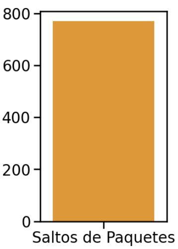

# Informe Laboratorio 4 

##### Integrantes del grupo: 

- Peralta, Mariano Daniel
- Quevedo, Luciano Tomás
- Scavuzzo, Marco Andrés
- Vazquez, Joaquín

---

## Título 
Algoritmos de enrutamiento en redes con topología de anillo

---

## Resumen 
Esta investigación se centra en estudiar y optimizar la asignación de recursos en una red con una topología en anillo utilizando un algoritmo de enrutamiento. Mediante la simulación de la red y el análisis del comportamiento de diferentes algoritmos de enrutamiento en diferentes escenarios, buscamos comprender cómo se utilizan los recursos de la red e identificar oportunidades de optimización.

Esta investigación tiene los siguientes objetivos:

- Estudiar el efecto de los algoritmos de enrutamiento en la utilización de recursos en redes de topología en anillo. 
- Encontrar fallas en la asignacion de recursos.
- Proporcionar modificaciones para optimizar los algoritmos de enrutamiento en topologías en anillo.

Si logramos esto, contribuiremos a la optimización de redes mediante la mejora del diseño e implementación de algoritmos de enrutamiento

---

## Introducción 
Vamos a utilizar la metodología de trabajo de simulación discreta para analizar la eficiencia de dos algoritmos en este tipo de redes. Este es un enfoque sistemático que permite estudiar el comportamiento de sistemas complejos mediante la recolección, procesamiento y evaluación estadística de los datos generados por modelos de simulación de eventos discretos. Una de las ventajas de utilizar esta metodología, es que permite analizar los sistemas sin necesidad de implementarlos fisicamente, otorgando una gran flexibilidad a la hora de modificar los distintos parámetros del sistema. Por otro lado, la validez de los resultados depende fuertemente de la calidad del modelo, por lo que una mala representación del sistema real puede llevar a conclusiones incorrectas.
Una red en anillo es una topología de red en la que cada nodo se conecta exactamente a otros dos nodos, formando una única ruta continua, para las señales a través de cada nodo: un anillo. Los datos viajan de un nodo a otro, y cada nodo maneja cada paquete. 

---

## Métricas 
Utilizamos las siguientes métricas: 
- Hops: Saltos que realizan los paquetes hasta llegar a destino
- Feedbacks: Cantidad de veces que un nodo receptor transmitió a al nodo emisor un paquete de feedback
- SendedPackets: Cantidad de paquetes generados por un nodo
- ResendedPackets: Cantidad de veces que un nodo reenvió un paquete recibido de otro nodo
- ReceivedPackets: Cantidad de paquetes que un nodo recibió paquetes que lo tenían como destino
- bufferSize: Tamaño (medido en paquetes) del buffer del nodo
- Delay: Tiempo de simulacion que tarda un paquete en ir desde su nodo de origen hasta su nodo destino

## Parte 1 
Primero, vamos a analizar dos casos de estudio sobre la red anillo utilizando un algoritmo de enrutamiento sencillo: los nodos siempre enviarán paquetes en sentido horario

---

### Análisis de los experimentos
 
### <pre>_Caso de estudio 1: Nodo 0 y 2 envían a nodo 5_</pre>
La configuración dada para el primer caso es la siguiente: 

- Network.node[0].app.interArrivalTime = exponential(1)
- Network.node[0].app.packetByteSize = 125000
- Network.node[0].app.destination = 5

- Network.node[2].app.interArrivalTime = exponential(1)
- Network.node[2].app.packetByteSize = 125000
- Network.node[2].app.destination = 5

### <pre>_Caso de estudio 2: Todos los nodos envían a nodo 5_</pre>
La configuración dada para el segundo caso es la siguiente:

- Network.node[{0,1,2,3,4,5,6,7}].app.interArrivalTime = exponential(7)
- Network.node[{0,1,2,3,4,5,6,7}].app.packetByteSize = 125000
- Network.node[{0,1,2,3,4,5,6,7}].app.destination = 5

#### Conclusión (Parte 1)

- Los recursos de la red no estan siendo aprovechados al maximo. En ambos casos, se dirige el trafico por los mismos enlaces siempre provocando problemas de congestion y flujo. Por un lado, no estamos haciendo una eleccion inteligente teniendo en cuenta cual es el mejor camino para que el flujo llegue lo mas rapido posible, simplemente elegimos uno por convencion. Por otro lado, no estamos teniendo en cuenta el estado de la red, esto afecta directamente nuestra metrica a mejorar pues si un buffer de un enlace del camino esta lleno provoca congestion consiguiendo que los paquetes se demoren mas en llegar.

- En el caso 1 se da un problema de congestion en el enlace del Nodo0->Nodo7. El Nodo 2 esta generando y repartiendo trafico hacia su derecha, llegando eventualmente al Nodo 0 para que este lo envie al Nodo 7. A su vez, el Nodo 0 esta generando y repartiendo trafico hacia su derecha tambien, hacia el Nodo 7. Esto provoca que el buffer de salida hacia la derecha (lnk[1]) reciba paquetes mas rapido de lo que puede desahacerse de ellos, impactando directamente sobre el delay de los paquetes.

- En el caso 2 se da un problema de flujo. Se elige siempre derecha a la hora de elegir un camino hacia el nodo destino, esto no necesariamente es lo mas eficiente pues, sin tener en cuenta ni siquiera problemas de congestion, no estamos tomando en cuenta cual es el camino mas rapido/corto hacia el nodo destino. 

- Nuestro objetivo es lograr que los paquetes lleguen lo mas rapido que se pueda, queremos minimizar el delay. Problemas de congestion y flujo nos alejan de esto pues aumenta el delay por paquete. Si pudieramos tener informacion periodica del estado de los enlaces para decidir el camino optimo en base a esto, podriamos distribuir inteligentemente el trafico.

---
## Parte 2

### Nuevo algoritmo 
Queremos minimizar el tiempo en el que los paquetes llegan a destino, sin que la red se congestione. Vamos a implementar un algoritmo que intenta solucionar esto.

La idea es que el algoritmo aprenda cual es el camino (horario o antihorario) que minimiza el delay para cada destino, y luego cuando quiera enviar un paquete a un destino cuyos costos son conocidos, ya sepa en qué sentido hacerlo, actualizando esta información periódicamente para evitar rutas congestionadas. Una especie de "machine learning" sobre los costos de la red.

Idea del algoritmo:
- Cada nodo cuenta con una tabla para cada uno de los demas nodos en la que guarda el costo de enviar un paquete hacia ese destino en sentido horario y en sentido antihorario.
- Inicialmente no conoce informacion sobre los caminos. En sus primeros dos envios manda paquetes por cada lado esperando. Esto para cada nodo destino posible.
un feedback de regreso que nos diga el costo de haber seguido ese camino.
- Una vez inicializados los valores, elige el camino con menor costo.
- Cada cierto tiempo(a traves de un contador), actualiza la informacion de los caminos para poder tomar una decision mejor en base.
al estado actual de la red. Si esto no se hiciera, la decision de mejor camino quedaria obsoleta rapidamente.

Implementacion:
- Cada nodo cuenta con una tabla para cada uno de los demas nodos en la que guarda el costo de enviar un paquete hacia ese destino en sentido horario y en sentido antihorario, y un arreglo en donde guarda un contador asociado a cada uno de los demás nodos.
- Un nodo "N" genera un paquete "P" con destino "D".
- N se fija si el contador "researchCounter" asociado a D está en 0.
- Si está en 0, olvida todos los costos asociados a D y reestablece researchCounter a su valor original.
- N se fija si conoce el costo de mandar P a D en sentido horario.
- Si no lo conoce, envía P en sentido horario con dos flags activadas: "clockWay" (indica al siguiente nodo que debe reenviar P en sentido horario) y "needFeedback" (indica a D que debe devolver un paquete feedback a N).
- Si N conoce el costo de mandar P a D en sentido horario, se fija si conoce el costo de mandar P a D en sentido antihorario.
- Si no lo conoce, envía P en sentido antihorario con una flag activada: "needFeedback" (indica a D que debe devolver un paquete de feedback a N).
- Si N conoce el costo de mandar P a D en ambos sentidos, envia P en el sentido cuyo costo sea menor (de ser en sentido horario, activa la flag clockway, de lo contrario, no). A la vez, decrementa el researchCounter asociado a D.
- Si un nodo distinto a D recibe P, se fija en la flag clockWay.
- Si está activada, envía P en sentido horario, si está desactivada, envía P en sentido antihorario.
- Si D recibe P, se fija en la flag needFeedback
- D envía P a la capa de aplicación exitosamente
- Si la flag estaba activada, D envía en sentido horario un paquete de feedback "F" a N, que indica el sentido en el que N envió a P y cuánto tardó P en ser enviado a la app desde que fue creado.
- Si un nodo distinto a N recibe F, envía F en sentido horario.
- Si N recibe F, registra el delay de P en el costo asociado a enviar hacia D en el sentido registrado en F. Luego N descarta F.

**(Notar que el algoritmo de machine learning solo funciona para redes con topología de anillo con una cantidad de nodos menor a 200. Esto se debe a que la tabla y el array que tiene cada nodo están definidos estáticamente con ese tamaño arbitrario)**

---

### researchCounter óptimo

Previo a realizar el análisis de los casos, vamos a averiguar cuál es el valor óptimo para el contador, es decir, el valor que minimice el delay promedio por paquete. (Lo medimos tanto en el caso1 como en el caso2, pero mostraremos solo los resultados en el caso1 ya que las diferencias son más apreciables en los gráficos)

### researchCounter = 10

.jpeg)

### researchCounter = 5

.jpeg)

### researchCounter = 3

.jpeg)

### researchCounter = 2

.jpeg)

### researchCounter = 1

.jpeg)

como vemos, el valor óptimo es researchCounter = 3

---

### Análisis de los experimentos

### <pre>_Caso de estudio 1: Nodo 0 y 2 envían a nodo 5_</pre>
La configuración dada para el primer caso es la siguiente: 

- Network.node[0].app.interArrivalTime = exponential(1)
- Network.node[0].app.packetByteSize = 125000
- Network.node[0].app.destination = 5

- Network.node[2].app.interArrivalTime = exponential(1)
- Network.node[2].app.packetByteSize = 125000
- Network.node[2].app.destination = 5

---

### <pre>_Caso de estudio 2: Todos los nodos envían a nodo 5_</pre>
La configuración dada para el segundo caso es la siguiente:

- Network.node[{0,1,2,3,4,5,6,7}].app.interArrivalTime = exponential(7)
- Network.node[{0,1,2,3,4,5,6,7}].app.packetByteSize = 125000
- Network.node[{0,1,2,3,4,5,6,7}].app.destination = 5

---
### Conclusión (Parte 2)

Frente al problema de congestion del Caso 1, podemos ver que el enlace Nodo0->Nodo7 ya no se ve tan afectado. En cambio, el trafico se distribuye aliviando la congestion sobre ese enlace e impactando directamente sobre la metrica de delay.

## Algoritmo original

## Algoritmo ML

## Algoritmo original

## Algoritmo ML

Frente al problema de flujo del Caso 2, podemos ver que el delay se ve reducido, se estan tomando decisiones mas inteligentes a la hora de distribuir el trafico teniendo tambien en cuenta el largo del camino que el paquete tomara. Esto afecta directamente al delay reduciendolo, pero los saltos promediono varían casi en nada.

## Algoritmo original

## Algoritmo ML

Podemos concluir que el algoritmo de machine learning optimizó bastante bien la asignación de recursos de la red. Evitando enviar paquetes por rutas congestionadas se logró que los buffers no crezcan tanto y agudicen la congestión, y que los paquetes lleguen a su destino en menos tiempo. Además, cuando no hay congestión, elige también la ruta más corta, minimizando el delay. Podemos también garantizar que no hay loops de enrutamiento ya que cuando se envía un paquete, se lo envía en una dirección inmutable y gracias a la topología de la red tenemos garantía de que en algún momento se topará con su destino si es que existe en la red.

## Discusión 
Nótese que no intentamos nunca minimizar (directamente) la cantidad de saltos por paquete. Lo que se necesita es que los paquetes lleguen lo antes posible a destino. Si tomáramos como "costo" a la cantidad de saltos, ignoraríamos por completo la posibilidad de que los buffers se llenen y que los paquetes se queden atascados ahí. Incluso si el algoritmo de machine learning no actualizara la información periodicamente (si se quedase con el primer costo que observó durante toda la simulación), se estaría ignorando la posibilidad de que haya congestión.

Una alternativa que intuímos que podría llegar a mejorar el desempeño del algoritmo de machine learning es que, en vez de usar un researchCounter para olvidar los costos y aprender otros nuevos, reciba feedback constante con cada paquete que envía y actualice sus costos permanentemente. 

Ejemplo:

- costo de enviar a D en sentido horario = 3
- costo de enviar a D en sentido antihorario = 4
- se genera paquete con destino a D
- se envia el paquete en sentido horario
- D recibe el paquete
- D envia feedback
- costo de enviar a D en sentido horario --> 5
- se genera paquete con destino a D
- se envia el paquete en sentido antihorario
- D recibe el paquete
- D envia feedback
- costo de enviar a D en sentido antihorario --> 6
- se genera paquete con destino a D
- se envia el paquete en sentido horario
- D recibe el paquete
- D envia feedback
- costo de enviar a D en sentido horario --> 2
- se genera paquete con destino a D
- se envia el paquete en sentido horario

## Referencias
Andrew S. Tanenbaum (2013) Redes de computadoras.

OMNeT++ Documentation.

Videos provistos por la cátedra.